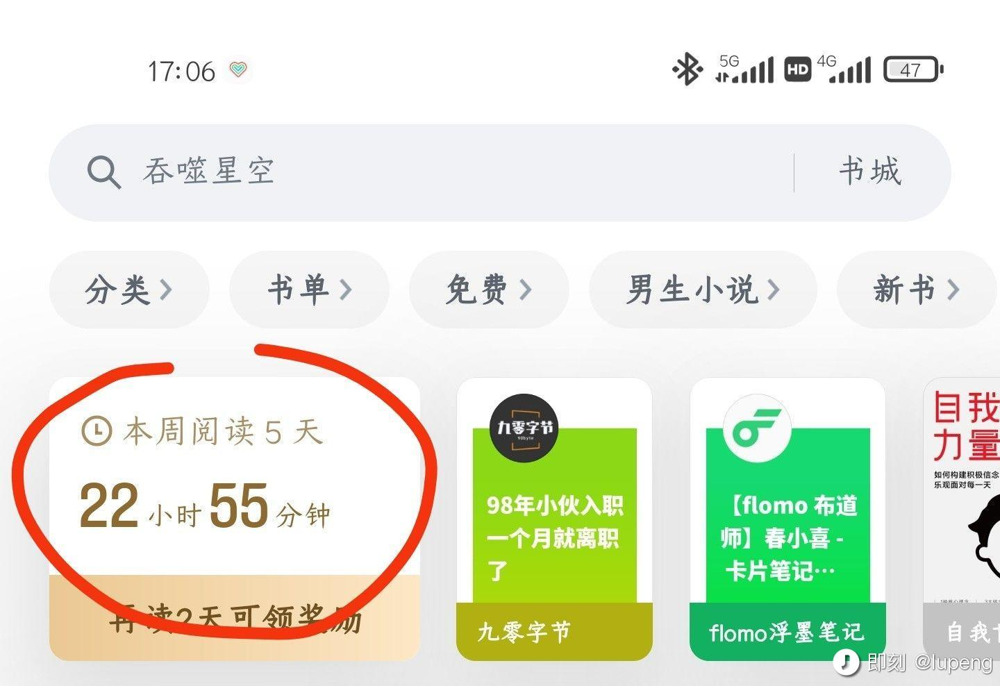

### 专注是另外一种境界

打开音乐软件播放歌曲，然后干其他的事，跟看着歌词专注的听旋律，是完全不同的两种境界，虽然都是在听歌。

看到可能性

### 生态的重要性

Android 系统是那种第一眼看上去很美很惊艳，随着不断深入使用，就发现各种随处可见的丑陋。

iOS 系统是那种第一眼看上去普普通通，随着不断深入使用，会发现那种各处统一的协调美，特别是用了一段时间 Android 系统之后，再回去用 iOS 系统，这种感觉会更加强烈。

当然，你应该能看出来，我指的不是原生系统本身的问题，而是系统生态的问题。

### 必需品

双 11 其实已经花了四五千块钱了，但是，总感觉啥也没买，没有剁手的感觉。

嗯，买必需品不叫剁手，买那些非常想要，但其实可有可无的东西才叫剁手。

### 休假带娃

休了两天假，感觉今天是周一。只是感觉在家带娃，也没感觉是在休假。倒是有点期待今天上班。

这两天一整天跟娃玩耍，倒是让我明白了：

为啥说 3 岁的孩子小恶魔？
为啥 3 岁就要去上幼儿园了？
为啥暮光之城里说幼童吸血鬼出世，整个家族都将被毁灭？

因为还不到 3 岁呢，就差点把他爹玩死。

### Windows

昨天晚上鼓捣一个项目的 Python 的环境，搞半天没搞好，而白天在公司 Windows 上很快就搞定了。

气一上头，突然就很想把家里的 iMac 换掉，躺床上安静下来，就想到，这些年过去了，现在的 Mac 似乎没有以前那么有吸引力了，伴随着 Windows 越来越开放。

犹记得以前 Mac 最吸引我的地方是，精致的外观(工业设计)，够美的界面 UI(适合设计)，以及相比 Windows 要开放的系统(适合开发)。

而现在这些优势都不再明显，目前主流设计工具都 Web 化了，开发环境容器化，目前除了 iOS 开发，找不到其他理由非用 Mac 不可了。

也许苹果发现软件系统的竞争力越来越弱，就开始发力自主研发芯片吧，M1 系列芯片的性能的确令人惊讶。

未来苹果电脑的核心竞争力应该在芯片性能上，加上一如既往的工业设计，将成为新的护城河。

只是对于系统控来说，有些失望罢了。

### 记日志

每天流水账的记日志，也写了这么多字。

虽然字数的统计没啥意义，也代表不了什么，但就这样也挺好，就像流水账日志似的，看起来毫无价值，但记录着我走过的痕迹。

嗯，又多了一个新的标签，你好，3月。

### 变革

很多公司都喜欢放着自己的长处优点不管，非要精力放着那些别人都在做的事情上，什么热做什么，而不是从什么稀缺，什么有价值的角度去考虑。

就像很多人找不到自己的优势，或者不重视自己的优势，或者不想放大自己的优势，而要去追逐那些自己不擅长，市场竞争激烈的方向。

聚焦，聚焦，不要追求大而全，想要大而全，可以拥抱合作。而不是自己全上，过于分散精力，原本有核心竞争力，却一步一步变得中庸。

### 虚心

即便你有丰富的工作经历，但在面对不了解的行业或业务的时候，还是要以虚心学习的心态去面对，也许对方也讲不出个啥新鲜玩意，但交流的态度很重要。

### 产品经理

产品经理最核心的能力不是市场/用户调研，也不是产品/策略设计，而是说服别人。

说服不了别人，想得再多，原型再高保真，屁也没用。

可是，说服别人又不是产品经理单方面的事，要是遇到那种就是「无法沟通」的人，真的是蛋疼呀。

很多产品经理把「需求规格说明书」写成了「产品设计文档」，写成了「技术白皮书」。

想了想，很长一段时间我也这么干过，主要因为那三个文档都是一个人来写的。

如果需求、设计和技术文档，是不同岗位的人来写，你能找到其中的区别吗？

### 成长

这些年的工作，一直在干着「怎么做」的事情，偶尔想想「做什么」的事，而「为什么要做」却是极少去思考。

### 记账

记账软件的分类设计真的是反人类，一笔费用为何只能归到一类？而又该归到哪类？

不管如何去管理分类，总是觉得不合适。只想简简单单的记账，花时间最多的却是设置分类。

如果让我来设计一款记账软件，标签体系一定是最先考虑的功能。

随着不断记录，属于你的分类自然便会呈现，而不用前期使用时总是纠结一笔费用应该属于哪个分类。

记账前期，记下来才是最重要的，能坚持记下去才有价值。

### 付费

### 分工

自己明白，给别人讲明白，是一回事。
给别人讲明白，跟写下来让别人看明白，又是一回事。

最近在写需求规格说明书的感触。

以前从需求到设计，一人全干了，就没有这样的问题，现在被限定只做需求分析，不做设计，不做项目管理，反而觉得点难了。可能是因为更专了一些吧。

### 抱怨分工

明明是产品经理一个人的活，非要分成 3 个人来干，真是心累。

下午拿着写了两个礼拜的需求文档，跟 UED 和项目经理讲清楚了，接下来就是 UED 去做原型和交互设计，项目经理去安排研发和排期了。

突然发现，不画原型，在需求文档中，描述功能设计，真的是酸爽，还不如自己画了。

奇葩的工作流程。

### 买电子产品

现在买电子产品比较谨慎了，给自己的一个要求是：一定要见到实物才决定是否购买。

这样的好处是：

1、有更长的时间来冷却购买欲望

很多时候的购买需求都是为了满足购买欲而诞生的，很多都是伪需求伪场景，头脑一热，手指一点，就下单了，而买回来之后，新鲜两天就放那堆灰了。而见到实物的要求，往往就就给自己预留了好长时间的考虑周期，因为找到实体店去看看实物，比在网上看看图片要麻烦多了。没准过段时间不去想，就会发现，好像买不买都行。

2、看到真容后，没准就打消购买欲望了

电商平台上的那些产品图片简直「没法看」，不是说不好看，而太好看，好看到真的以为实物就是那样了，那么大的黑边，都能看似全面屏。有些产品去店里看看实物，没准就打消了要购买的欲望。

3、试着用一下，用户体验没准就劝退了

骁龙xxx、Intel ix、x亿像素这些参数值都没啥用，打开word要几秒，相机启动要几秒，蓝牙连接的交互体验，打开N个App切换的流畅度，都是那些参数值没办法告诉你的。上手体验一下，很快就会发现自己的接受程度。

说了这么多，都在说如何劝退购买电子产品，唉，要是不在乎，还谨慎个屁呀，买就行了。

### 工作的成就感

我发现，我现在能在工作中获得成就感，都在与人沟通了。主要以下三种场景：

第一，需求评审，评审结果不重要，重要的是，我把我想要讲的讲完了，当然达成一致最好，即便不一致，会后也会很轻松，就像憋了好久的话，一下都说完了。

第二，了解新产品，给研发打电话，让他给我解释功能背后的技术原理，解心中之惑，同样很爽，再加上吐槽几句之前产品设计的不合理功能，更爽。

第三，市场宣讲，向市场端介绍产品特性。写 PPT 的过程很痛苦，但讲完是真的爽。给客户宣讲，也是同样的感觉。

但是……

矛盾点是，性格使然，在与人沟通之前，内心极其抵触要去沟通这件事。
