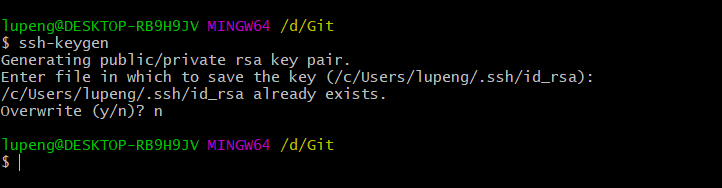

### SSH 密钥登陆服务器

#### 生成公钥

在本地终端，输入 `ssh-keygen` 命令后，一路回车就可以了。

Windows 电脑建议提前安装 [Git 客户端](https://gitforwindows.org/)，千万别用 cmd 来操作。

然后就可以在用户根目录下找到 `.ssh` 目录了，里面有一个 `id_rsa.pub` 的文件，就是本机的公钥了。

#### 复制公钥

复制的话，用下面这个命令把它拷贝一份到 D 盘根目录上。

`cat ~/.ssh/id_rsa.pub > /d/1.txt`

复制内容，贴到 `Github-Setting-SSH and GPG keys` 里面，就可以不用密码 push 代码了。

如果把它放到服务器上，就可以不用密码登陆服务器了，怎么把公钥上传到服务器上？很简单，只需要下面这条命令就可以了。

`ssh-copy-id -i ~/.ssh/id_rsa.pub root@xxx.xxx.xxx.xxx`

原理就是在把公钥内容，复制到了服务器上 root 用户 `.ssh` 目录下的  `authorized_keys` 文件里。

好了，可以尝试 `ssh root@xxx.xxx.xxx.xxx` 登陆服务器了。

### 配置网络

如果是在云服务商购买的云服务器，默认你的网络是正常的。

### 下载软件

#### CenOS 8 yum 失败

[完美解决CentOS8 yum安装AppStream报错，更新yum后无法makecache的问题 - 白_胖_子 - 博客园](https://www.cnblogs.com/bpzblog/p/13918199.html)

[centos镜像-centos下载地址-centos安装教程-阿里巴巴开源镜像站](https://developer.aliyun.com/mirror/centos)

#### 安装 Git、Nginx 以及 tmux

很简单了，`yum install -y git nginx tmux`  就可以了。

