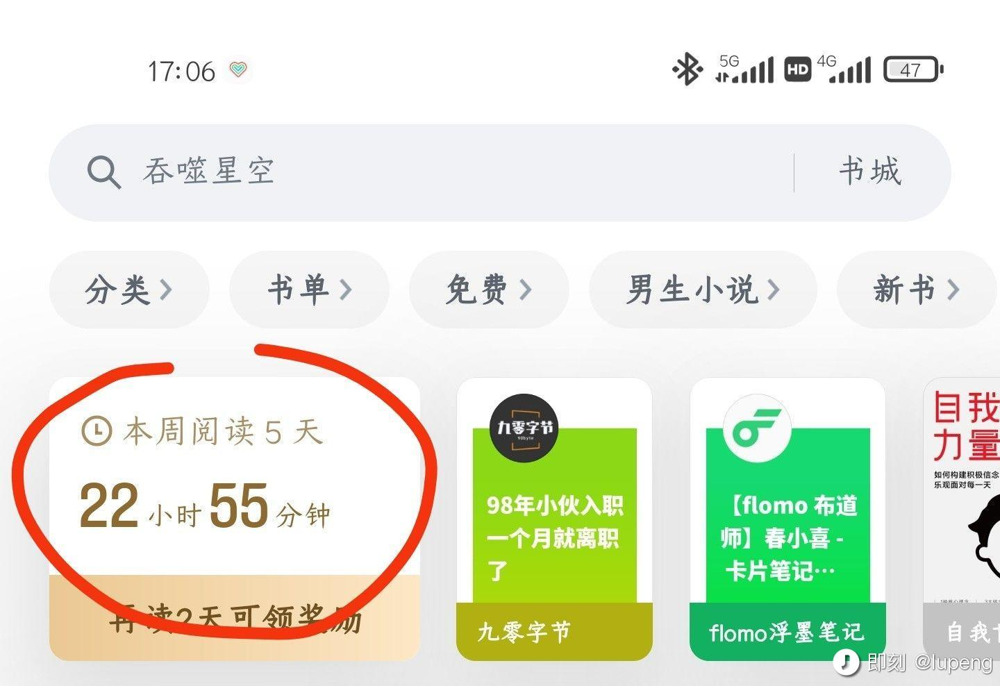

从学生时代就喜欢折腾系统，先是 PC 操作系统，再是手机操作系统，到现在折腾 App，如果说我业余有什么爱好的话，那一定是系统控、软件控还有工具控。

折腾归折腾，但其实给我留下来的收获并不多，大多都停留在玩的阶段了。别人的业余时间用来玩游戏了，而我竟然是玩系统，听起来怪怪的，不过的确如此。

又由于我是一个产品经理，对效率工具的使用，总有一些追求和洁癖。并且我有写作、记录和阅读的习惯，这些年折腾的工具软件倒是不少（但这里不是想要推荐工具软件）。

折腾之余，也渐渐形成了自己选择工具软件的一套标准，平时零散的记录了下来，这篇文章总结一下。

### 目录
- 工具只是工具，关键在用的人
- 以终为始，工具是为了解决问题
- 拒绝从一而终，拥抱变化
- 先用再说合适不合适，可能不是工具的问题，而是你的问题
- 先试用再决定是否长期试用
- 试用期间要关注的几个点
- 付费 VS 免费

- 订阅 VS 买断
- 付费考虑的几个点

### 工具仅仅是工具，关键在用的人
很多时候，我们容易陷入一个误区，认为那些知识管理做得好的人，是因为工具选择得好。

换个角度，想当然的以为，自己如果用了相同的工具，就能够获得和那些优秀的人同样的能力似的。

以为换了个读书 App，就能多读几本书，以为换了个笔记工具，就能多做一些记录；以为换了个写作工具，就能多些几篇文章。

千万别有这种幻想，再牛逼的工具，也帮不了你做本质的改变。真正爱读书的人，即便捧着纸质书，也比那些又是 Phone 又是 Kindle 又是 Pad 的人读得多。

### 以终为始，工具是为了解决问题

曾经有一段时间，一直在 Kindle 上读书，觉得体验很好，就希望把所有的书籍都放到 Kindle 上来看，当然中间少不了一系列的折腾。甚至有的时候 Kindle 上没有某本书，别的平台即便有，都会迟迟不去读这本书。

这就是典型的没搞清楚，使用 Kindle 这个读书软件，究竟是为了什么。

使用某个工具，一定是为了解决某个问题。即便只是为了体验，也是解决了你的好奇或是学习的这个问题。

### 拥抱变化，拒绝从一而终
拒绝完美主义，拒绝从一而终。对于工具的使用，更是如此。

这就是典型的完美主义，让工具占据了主导地位，没搞清楚自己的根本诉求是什么，不是在哪里读书的问题，而是要读这本书，从这本书上获取自己想要的信息。

衍生而来的一个观点就是，工具只是为了满足你短期或者长期某种需求的路径而已，重点在满足需求，路径有很多。

俗话说，不要在一棵树上吊死。没有读书 App 你还不读书了吗。

### 先用再说合适不合适
在决定要使用某个工具，来满足自己自己某方面需求的时候，一定要先用起来再说，合适不合适也要建立在你已经认真试用过的基础上。

一个简单的例子，对于记账这个需求，很多人下了一个记账软件，记了两天没坚持记下去。

然后就归咎于软件不好用，没能让我坚持记下去，再换一个记账软件，又试了几天，又说不适合我，接着再试，往复如此，愣是没有把帐记起来。

工具软件可不背这个锅，有些人拿 excel 都能完成记账这个事。

在决定要使用某些工具产品，帮助自己的时候，先不要考虑怎么用最合适，也不要去想如何最大程度发挥它的作用，以及如何最大程度满足自己的需求。

想这么多干啥，先用了再说。

就像做一个产品的 MVP，别想那么远，那么多，那么全面，先搞出来再说。

### 用什么工具不重要，重要要去用

使用苹果自带的备忘录软件，记录了大概两年的每天流水账日志，近期计划放弃备忘录，开始在[@flomo浮墨 ](https://web.okjike.com/u/79AB033A-F19D-404B-8C1E-8E010E032198)上记录。

不为别的，主要是因为我换安卓机当主力了，偶尔用 iPhone，也可以用 iOS 版的 flomo 继续记录。

对于我来说，跨平台和云同步是记录类软件最最基本的的功能，缺一不可。

### 选择记录软件的标准

我有两条准则，几乎可以筛选掉九成的选择。

1，不支持跨平台的软件一律不会深入使用
2，记录类软件不支持通用格式导出的，也一律不会深入使用

### 付费

#### 付费模式

以前，我喜欢软件买断制，感觉买断了才是自己的，软件是个人物品；

现在，我喜欢订阅制，有用了好用了，我才会一直订阅下去，软件只是辅助工具。

比如微信读书：

连续两周超过 20 小时，果断买了会员。
懒得再去领无限卡。

当一个 App 已经占用我那么长时间的时候，那点会员费就不值得一提了。

这也是我对一个 App 或者服务是否付费的主要依据。

是否愿意付费，主要不取决于对方提供了什么差异化功能或服务，而取决于我使用的时长或频次。

当初买 jike yellow 的时候，就是这样的思路。

基于这样的思路，我也更倾向于订阅式的付费，而不喜欢买断。因为如果哪天我不喜欢某个服务或者 App了，我可以毫无负担的取消订阅，而没有任何心里负担(当初花那么多钱)。

#### 付费周期