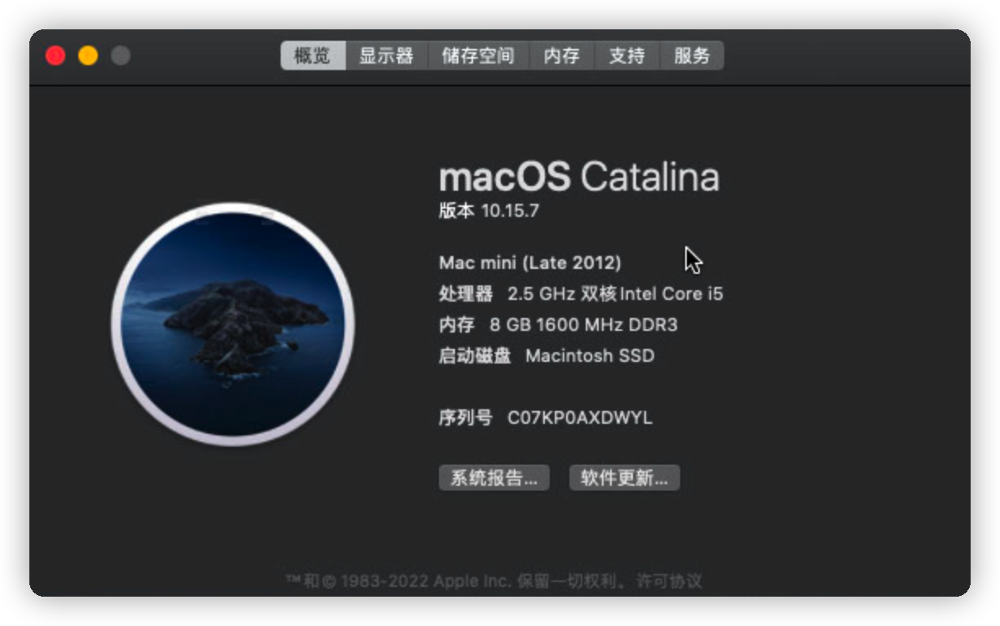
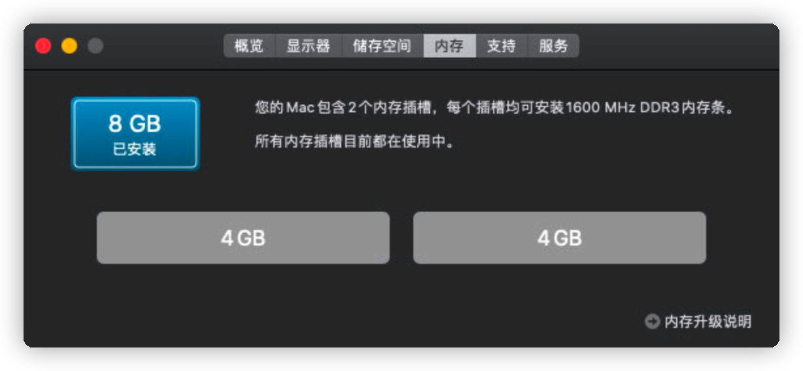
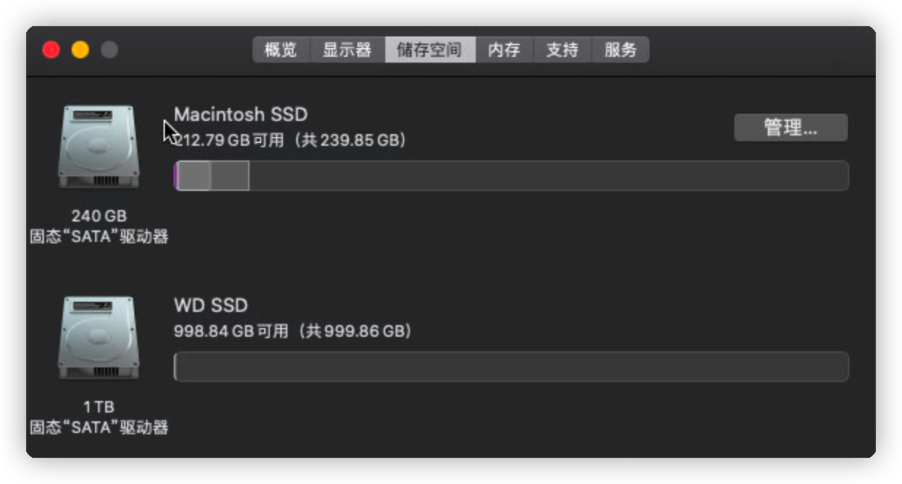

这已经是第三次升级这台 Late 2012 版本的 Mac mini 了。

<!-- more -->

- 第一次是简单升级了一下内存，从 4G 升级到了 8G，打开后盖就可以了
- 第二次是升级了硬盘，从 500G 机械盘，升级成了 256 SSD + 500G 机械，那次换盘是直接拆到底了，因为启动盘在最底下，庆幸装回来没啥事，只是莫名多了几个螺丝钉，好在这些年使用也没啥问题
- 第三次也就是这次，中间隔了近两年时间，又把它掏出来了，计划再升级一下，把 500G 机械盘换成了 1T SSD，这次换盘没上次麻烦，因为不用动启动盘，而是把上面哪个盘位替换一下，扩充一下容量，让它当作家庭的文件共享中心

