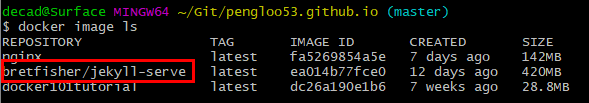
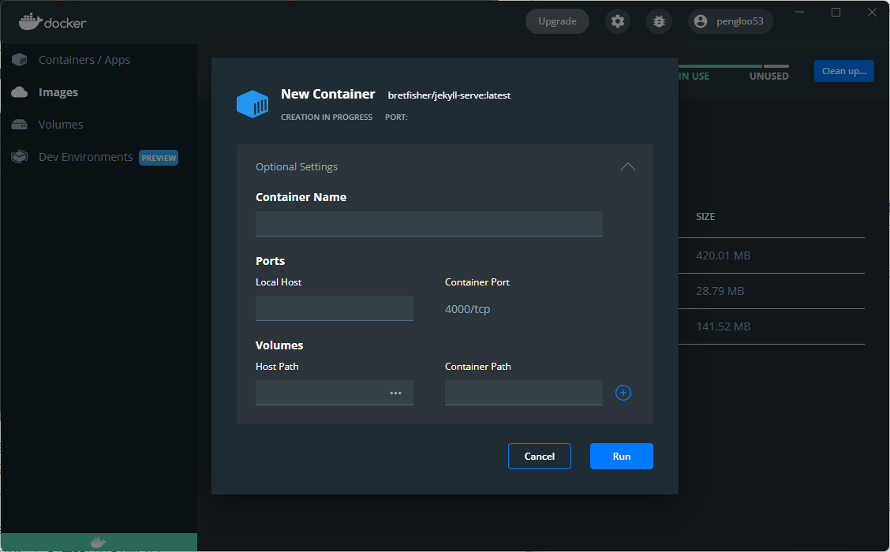

## 制作镜像

Docker 入门那篇文章

```
FROM node:8.4
COPY . /app
WORKDIR /app
RUN npm install --registry=https://registry.npm.taobao.org
EXPOSE 3000
CMD node demos/01.js
```

上面代码一共五行，含义如下。

- `FROM node:8.4`：该 image 文件继承官方的 node image，冒号表示标签，这里标签是`8.4`，即8.4版本的 node。

- `COPY . /app`：将当前目录下的所有文件（除了`.dockerignore`排除的路径），都拷贝进入 image 文件的`/app`目录。

- `WORKDIR /app`：指定接下来的工作路径为`/app`。

- `RUN npm install`：在`/app`目录下，运行`npm install`命令安装依赖。注意，安装后所有的依赖，都将打包进入 image 文件。
- `EXPOSE 3000`：将容器 3000 端口暴露出来， 允许外部连接这个端口。

- CMD 命令是在启动 container 的时候执行命令


使用了 CMD 的命令，就不能在启动容器的时候，执行命令了。例如下面的就不对了。

```
docker container run -p 8000:3000 -it koa-demo /bin/bash
```


## Jekyll 服务

学习 Docker 的初衷就是为了要将自己的 Blog 通过 Docker 的方式部署到服务器上，


### 使用别人的镜像

#### 下载镜像

这里使用的 Image 是 [BretFisher/jekyll-serve](https://github.com/BretFisher/jekyll-serve)，关于 Jekyll 的镜像虽然比较多，但是都比较老，能正常跑起来的却不多，这个镜像我在 Windows、CentOS 以及 Mac 上都试过了，目前来看没有问题。

作者把这个镜像发布到了 [hub.docker.com](https://hub.docker.com/) 仓库上，通过下面的命令便可下载到本地。

```
docker pull bretfisher/jekyll-serve
```

然后，通过命令 `docker image ls` 就可以看到下载的镜像。



#### 启动容器

通过下面命令创建实例，启动容器。

```
docker run --name jekyll-test --rm -p 4000:4000 -v $(pwd):/site bretfisher/jekyll-serve
```

这里的 `-v $pwd:/site`  指的是挂载本地当前目录到容器里的 /site 目录下


## Docker Compose


## 附：图形界面



图形界面每一个参数的设置与命令行其实是对应的，而且如果你熟悉了命令行，你会发现，还是命令行好用，功能更全。

这里列一下启动容器的几个参数与命令行的对应关系：

- Container Name 对应的就是 --name，自定义容器的名称
- L哦擦开Ports 对应的是映射端口号
