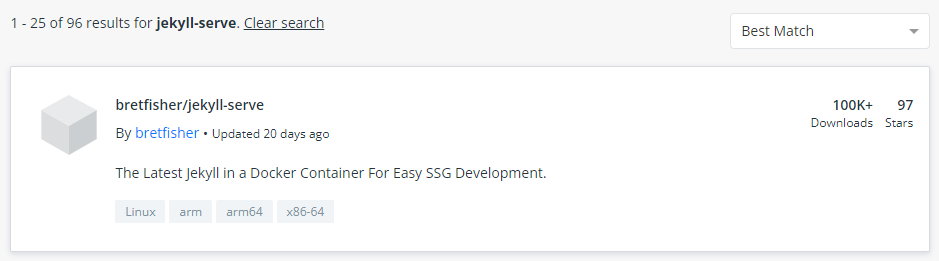
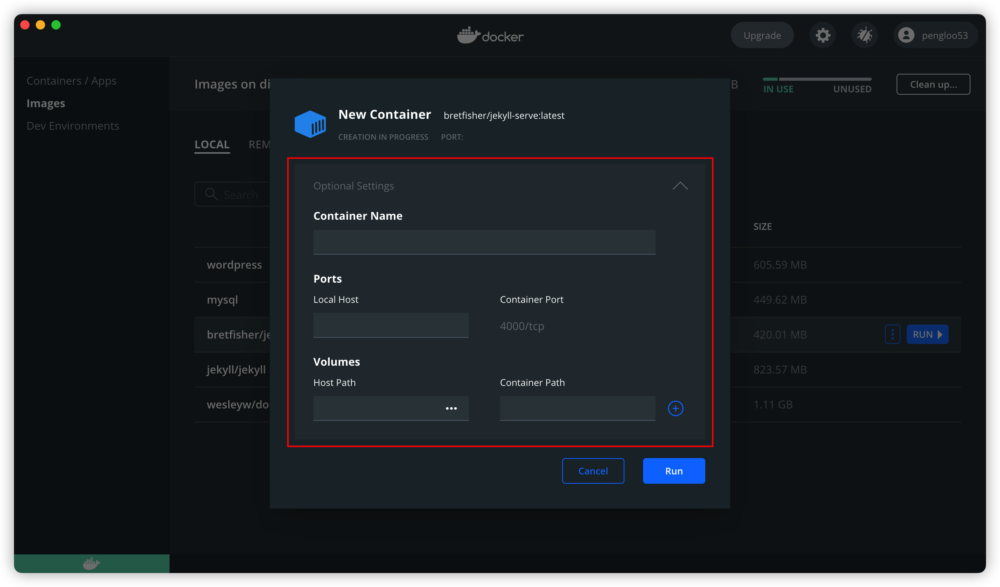
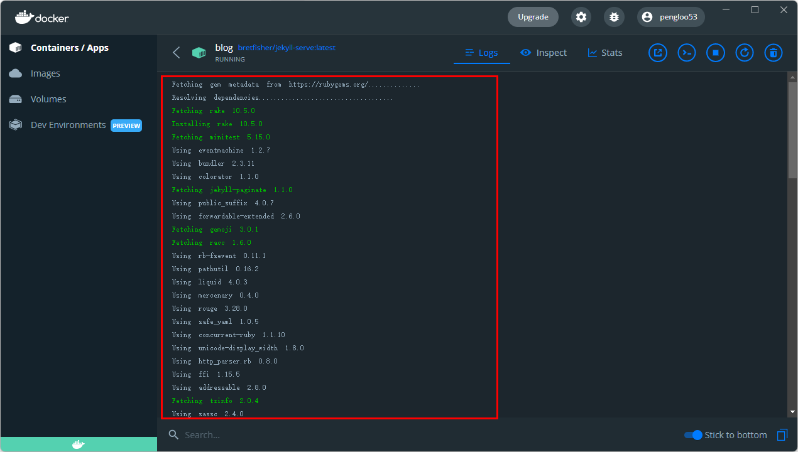

我学习 Docker 的初衷，其实是为了在 Windows 系统的环境下搭建一个 Jekyll 的环境，可以预览博客，便于在上班时间摸鱼发文章，嗯，最初的动机就是这么的单纯。

在使用 Docker 之前，其实也尝试过直接在 Windows 下部署 Ruby 环境，但总是因为一些原因而失败，Ruby 似乎对 Windows 非常不友好，后来索性不折腾了，学点 Docker 吧，于是就有了[入门](/2022/05/02/docker.html)那篇文章。

那篇文章非常基础，不过总算了搞懂了 Docker 的基本原理，并且学会了常用命令。然后这篇文章，将达成最终的目的，将 Jekyll 博客通过 Docker 的方式，跑在自建服务器上。

文章大致分为以下几个部分：

- 准备 Jekyll 镜像，学着制作一个镜像
- 结合 Nginx 容器，学会使用 Compose
- 搭建自动化发布流程

<!-- more -->

## 准备 Jekyll

基于 [Docker 入门](/2022/05/02/docker.html)那篇文章的总结，我们知道制作一个镜像，需要编写 Dockerfile 配置文件。

但是，我并没有上来就开始编辑 Dockerfile，而是在仓库中找了一个 Jekyll 的镜像，先试了下。

### Copy 一个镜像



上面镜像的地址是 [BretFisher/jekyll-serve](https://github.com/BretFisher/jekyll-serve)，关于 Jekyll 的镜像比较多，但是能正常跑起来却没有多少，因为年代都太久远了。

在 Jekyll blog 的根目录下，使用下面的命令就可以启动容器了

```
docker run --name jekyll-test --rm -p 4000:4000 -v $(pwd):/site bretfisher/jekyll-serve
```

上面这条命令的参数解释如下：

- `--name` 给容器自定义一个名称
- `--rm` 表示在容器停止后，自动删除容器文件
- `-p` 端口映射，本地:容器
- `-v` 目录映射，本地:容器，`$(pwd)` 表示本地运行 `pwd` 命令的结果，也就是代表当前目录，这里的 `$pwd:/site`  指的是映射本地当前目录到容器里的 /site 目录下

Windows 下可能会出现 Access Denied 的提示，简单查了一下问题，似乎是个 bug 没有找到解决办法。如果你也遇到，临时可以通过图形界面来启动容器。





图形界面的选择项很简单，就不多解释了，基本上就是对应上面介绍的几个参数值。

### Build 一个镜像

```bash
FROM ruby:2-alpine as jekyll

RUN apk add --no-cache build-base gcc bash cmake git gcompat

# install both bundler 1.x and 2.x incase you're running
# old gem files
# https://bundler.io/guides/bundler_2_upgrade.html#faq
RUN gem install bundler -v "~>1.0" && gem install bundler jekyll

EXPOSE 4000

WORKDIR /site

ENTRYPOINT [ "jekyll" ]

CMD [ "--help" ]


FROM jekyll as jekyll-serve

COPY docker-entrypoint.sh /usr/local/bin/

# on every container start, check if Gemfile exists and warn if it's missing
ENTRYPOINT [ "docker-entrypoint.sh" ]

CMD [ "bundle", "exec", "jekyll", "serve", "--force_polling", "-H", "0.0.0.0", "-P", "4000" ]
```

上面代码一共五行，含义如下。

- `FROM node:8.4`：该 image 文件继承官方的 node image，冒号表示标签，这里标签是`8.4`，即8.4版本的 node。

- `COPY . /app`：将当前目录下的所有文件（除了`.dockerignore`排除的路径），都拷贝进入 image 文件的`/app`目录。

- `WORKDIR /app`：指定接下来的工作路径为`/app`。

- `RUN npm install`：在`/app`目录下，运行`npm install`命令安装依赖。注意，安装后所有的依赖，都将打包进入 image 文件。
- `EXPOSE 3000`：将容器 3000 端口暴露出来， 允许外部连接这个端口。

- CMD 命令是在启动 container 的时候执行命令


使用了 CMD 的命令，就不能在启动容器的时候，执行命令了。例如下面的就不对了。

```
docker container run -p 8000:3000 -it koa-demo /bin/bash
```


###

`docker-entrypoint.sh` 脚本

```bash
#!/bin/bash
set -e

if [ ! -f Gemfile ]; then
  echo "NOTE: hmm, I don't see a Gemfile so I don't think there's a jekyll site here"
  echo "Either you didn't mount a volume, or you mounted it incorrectly."
  echo "Be sure you're in your jekyll site root and use something like this to launch"
  echo ""
  echo "docker run -p 4000:4000 -v \$(pwd):/site bretfisher/jekyll-serve"
  echo ""
  echo "NOTE: To create a new site, you can use the sister image bretfisher/jekyll like:"
  echo ""
  echo "docker run -v \$(pwd):/site bretfisher/jekyll new ."
  exit 1
fi

bundle install --retry 5 --jobs 20

exec "$@"
```


## Docker Compose

```bash
version: '2.4'

services:
  jekyll:
    image: bretfisher/jekyll-serve
    volumes:
      - .:/site
    ports:
      - '4000:4000'
```


