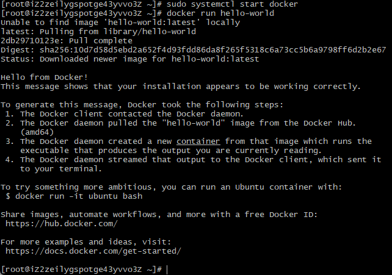

## 安装

### Windows 安装 Docker

官网下载地址：[Docker Desktop for Mac and Windows | Docker](https://www.docker.com/products/docker-desktop)

安装界面：


### CentOS 8 安装 Docker

[CentOS8 安装 Docker-阿里云开发者社区](https://developer.aliyun.com/article/753261?accounttraceid=778f786f99dc4a1689b886735dbdb33bfmei)

#### 1. 卸载老版本

```
yum remove docker \
                  docker-client \
                  docker-client-latest \
                  docker-common \
                  docker-latest \
                  docker-latest-logrotate \
                  docker-logrotate \
                  docker-engine
```

#### 2. 安装docker 基础包

```
yum install -y yum-utils \
  device-mapper-persistent-data \
  lvm2
```

#### 3. 设置稳定仓库

```
yum-config-manager \
    --add-repo \
    https://mirrors.aliyun.com/docker-ce/linux/centos/docker-ce.repo
```

#### 4. 安装Docker Engine - Community

- 安装最新版本(latest)

```
yum install docker-ce docker-ce-cli containerd.io
```

- 安装指定版本

```
yum list docker-ce --showduplicates | sort -r  #查看版本
sudo yum install docker-ce-<VERSION_STRING> docker-ce-cli-<VERSION_STRING> containerd.io #安装指定版本
```

#### 5. 启动与测试

```
sudo systemctl start docker  # 启动docker
docker run hello-world  #测试
```

运行后会显示下图，说明docker安装成功。




### Mac 安装 Docker


## 使用

### 基本命令

#### 镜像 image

```bash
# 列出本机的所有 image 文件。
docker image ls

# 删除 image 文件
docker image rm [imageName]

# 从仓库中拉取 image
docker image pull [imageName]

# 基于 Dockerfile 创建 image，-t 指定 image 文件名称，可指定标签，最后跟 Dockerfile 的路径
docker image build -t koa-demo .
docker image build -t koa-demo:0.0.1 .
```

注意：尽量使用别人制作的 image 文件，多从[官方仓库]([Docker Hub Container Image Library | App Containerization](https://hub.docker.com/))看看。

#### 容器 container

```bash
# 列出本机正在运行的容器
docker container ls
# 列出本机所有容器，包括终止运行的容器
docker container ls --all

# 删除容器文件
docker container rm [containerID]

# 从 image 生成一个运行的实例
docker container run hello-world
# 命令行体验 Ubuntu 系统，运行服务，-it 映射 Shell
docker container run -it ubuntu bash
# 映射本地端口，-p 本地 8000 映射容器 3000 端口
docker container run -p 8000:3000 -it koa-demo /bin/bash
# 容器终止运行后，自动删除容器文件
docker container run --rm -p 8000:3000 -it koa-demo /bin/bash

# 终止运行容器文件，stop 软终止，kill 强制终止
docker container stop [containID]
docker container kill [containID]

# 启动容器，不会新建容器文件
docker container start [containID]

# 终端日志，Shell 的输出
docker container logs

# 进入正在运行的容器
docker container exec -it [containerID] /bin/bash

# 拷贝容器的文件到本地
docker container cp [containID]:[/path/to/file] .

```

注意的是：实例停止，并不代表容器文件删除。

### Dockerfile 文件

一个纯文本的配置文件，用来生成 image，Docker 根据该文件生成二进制的 image 文件。

#### .dockerignore

排除文件打包到 image 中，用法类似 .gitignore

#### Koa 示例

```bash
FROM node:8.4
COPY . /app
WORKDIR /app
RUN npm install --registry=https://registry.npm.taobao.org
EXPOSE 3000
```

上面代码一共五行，含义如下。

- `FROM node:8.4`：该 image 文件继承官方的 node image，冒号表示标签，这里标签是`8.4`，即8.4版本的 node。

- `COPY . /app`：将当前目录下的所有文件（除了`.dockerignore`排除的路径），都拷贝进入 image 文件的`/app`目录。

- `WORKDIR /app`：指定接下来的工作路径为`/app`。

- `RUN npm install`：在`/app`目录下，运行`npm install`命令安装依赖。注意，安装后所有的依赖，都将打包进入 image 文件。
- `EXPOSE 3000`：将容器 3000 端口暴露出来， 允许外部连接这个端口。

#### CMD 命令

```
FROM node:8.4
COPY . /app
WORKDIR /app
RUN npm install --registry=https://registry.npm.taobao.org
EXPOSE 3000
CMD node demos/01.js
```

注意：指定了 CMD 命令，则在启动 container 的时候，就不能再附加命令了。

正确：

```bash
docker container run --rm -p 8000:3000 -it koa-demo:0.0.1
```

错误：

```
docker container run -p 8000:3000 -it koa-demo /bin/bash
```

#### 发布 image

在 [hub.docker.com](https://hub.docker.com/) 上注册账号

```bash
# 登录仓库
docker login

# 标注用户名和版本
docker image tag [imageName] [username]/[repository]:[tag]
# 示例
docker image tag koa-demos:0.0.1 ruanyf/koa-demos:0.0.1
# 或者不标注，重新构建 image
docker image build -t [username]/[repository]:[tag] .

# 发布 image 到仓库
docker image push [username]/[repository]:[tag]
```

## 示例

### 搭建 WordPress

### 


### 搭建 Jekyll

